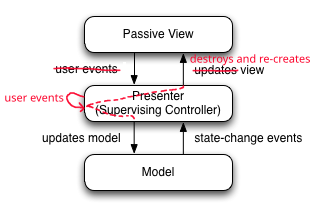

# devolve-ui comparisons

## React

devolve-ui is very similar to React. The main difference is that React is designed with DOM in mind, while devolve-ui is designed for canvas and terminal rendering.

Because devolve-ui targets canvas and terminal it's more liberal throwing away stale views and doesn't have to "diff" and mutate existing views for state changes. React does, because otherwise you would have performance issues (DOM nodes are expensive), and some elements like text-fields would be janky. devolve-io renders raw text (terminal) or pixi nodes (web), and these are inexpensive enough that they can be re-created every frame without causing too noticeable a performance drop. That being said, devolve-ui still tries to cache views and prefers not re-creating every frame when necessary.

devolve-ui also encourages more separation between app model and view/controller. React apps are typically rendered with `ReactDOM.createRoot(document.body).render(<App />)`, while devolve-ui apps are rendered with `const devolveUi = new DevolveUI(App, model)`. The key difference is that you can modify `model` through `devolveUi.p.someProperty.v = ...` and it will re-render `App`, but once you render a React app, you can't modify any props you passed to `App` or `App`'s internal state outside of `App` itself.

The idea in devolve-ui, is that you pass your app's "model" to the components through `new DevolveUI`, and it is separate: the only state in `useState` should be view-specific state like "currently selected element" or "currently active window". In React, your `App` and other components not only render your app and handle input, but often store important app state as well.

devolve-ui also has some minor syntactic differences, e.g. using `state.v =` instead of `setState`. Some of these were created in direct response to React's pitfalls: specifically, the stale closure problem, verboseness of passing around `foo` and `setFoo` props, and confusing semantics as to when `useEffect` is called.

## solid.js

solid.js has a very similar API to React, but under-the-hood is uses [observers](https://refactoring.guru/design-patterns/observer) instead of ["virtual DOM" and diffing](https://reactjs.org/docs/reconciliation.html#the-diffing-pattern) to track changes. At a high-level, solid.js tracks where you reference state, so that it only has to re-compute those references when the state changes. See [solid.js's guide](https://www.solidjs.com/guides/comparison) for more.

devolve-ui doesn't use observers, so it's more like React than solid.js in this regard. devolve-ui does have a "virtual DOM" in the form of views, which are re-created liberally.

devolve-ui and solid.js are similar in that they were both inspired by React, and both attempt to fix some of React's problems like slow performance and stale closures.[1]

[1] Addendum: In [this article](https://typeofnan.dev/solid-js-feels-like-what-i-always-wanted-react-to-be/) the author demonstrates a lot of intuitive ways to write a simple counter which "just work" in solid.js, but unintuitively fail in React because of stale closures. If you adjust the examples with devolve-ui's syntax (in particular `useInterval` instead of `setInterval`), they also "just work" in devolve-ui.

## [Model-View-Presenter (MVP) pattern]((https://en.wikipedia.org/wiki/Model–view–presenter))

devolve-ui is a twisted adaptation of the MVP pattern if you squint hard enough.

In devolve-ui, the **model** is what you pass to `DevolveUI` and your root component. The **views** are the primitives: `box`, `text`, `pixi`, etc. The **presenters** are the component functions.

Component functions are input the model as `props`, and they output a tree of views which render this model: just like presenters, they adapt the model to the view. They also modify the model via callbacks, just like presenters.

devolve-ui doesn't *entirely* follow the model-view-presenter pattern. The biggest difference is that the "presenter" (component) handles user events, not the view. Also, each time the model updates, instead of mutating views the component just destroys and recreates them. However, MVP is probably the closest well-known pattern to what idiomatic devolve-ui apps follow.
